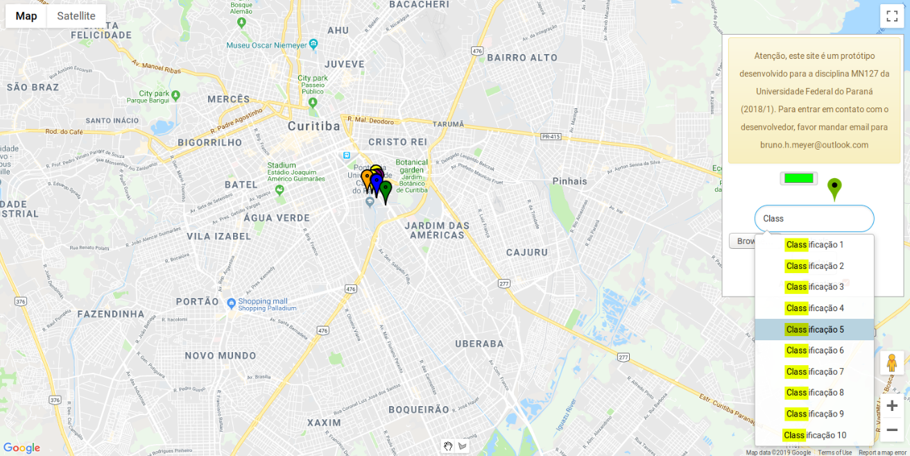

# HIM - Healthcare Inteligent Map

## Context of development

This work was initially developed to MN127. An degree course offered in 2018/1 of Universidade Federal do Paraná.
The objective of this project was to prototype a tool that proccess and
display the data collected from ESaude, a plataform that is used in basic healt unities in Curitiba.
The data model was designed to collect the report collected from ESaude. There is an example in `data/example.xls` 

## Description

This project contains an front-end web implementation for data visualization.
There is no need for an centralized service. We use essentially the
[firebase](https://firebase.google.com/docs/reference/) and
[google maps](https://developers.google.com/maps/documentation/javascript/tutorial)
api. The user must upload an report spreadsheet into html page, and it will
proccess the data only in the user computer.

To use this project, you must change the files `js/load_firebase_api`, and
`js/load_googlemap_api.js` and define the keys and configurations of these api.

However, we use the google api and firebase to store and execute queries
related to a function that found an geolocalization from a address.
We use a local storage system that reduce the number of queries executed,
what solve the problem of over query in google maps api.

A demo version of this project can be accessed in: http://www.inf.ufpr.br/bhmeyer/mn127

## Features

- Search of peoples (users) by diseases
- Search of peoples (users) by programs disease
- Search of peoples (users) by name
- Search filter by actives or inactive patients
- Marker and Polygon draw tool
- Address marker information
- Visualization of data into google maps

## Contributions
- Bruno B. Marba
- Bruno Henrique Meyer
- Hannes Adolf
- Helena Houtz Spina
- Maevelyn Diaz de Lima
- Nikolas Augusto Eschholz Leal
- Nikolas Terra Sales
- Roberto Kano
